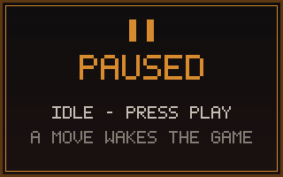

<h1 align="center">Hi, I'm <a href="https://nikitastetskiy.github.io">Nikita Stetskiy</a>!</h1>

  

  <strong><a href="mailto:nikitastetskiy@gmail.com">Email</a></strong> |
  <strong><a href="https://nikitastetskiy.github.io">Portfolio</a></strong> |
  <strong><a href="https://nikitastetskiy.github.io/resume.pdf">Resume</a></strong> |
  <strong><a href="https://www.linkedin.com/in/nikitastetskiy">LinkedIn</a></strong>

&nbsp;I'm currently working on contributing more to open source projects!&nbsp;

<h2 align="center">🎮 Playable DOOM</h2>

  <strong>How to play:</strong> click a control, then press <strong>Submit</strong> on the pre-filled issue — your move runs automatically.

<!-- DOOM:START -->

  

🕹️ Controls are being wired up — the arcade opens soon.

<!-- DOOM:END -->

<!--
**nikitastetskiy/nikitastetskiy** is a ✨ _special_ ✨ repository because its `README.md` (this file) appears on your GitHub profile.

Here are some ideas to get you started:

- 🔭 I’m currently working on ...
- 🌱 I’m currently learning ...
- 👯 I’m looking to collaborate on ...
- 🤔 I’m looking for help with ...
- 💬 Ask me about ...
- 📫 How to reach me: ...
- 😄 Pronouns: ...
- ⚡ Fun fact: ...
-->
